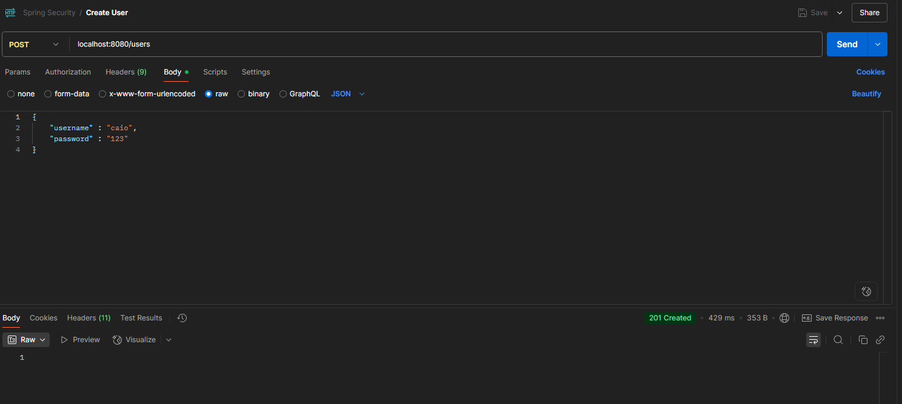
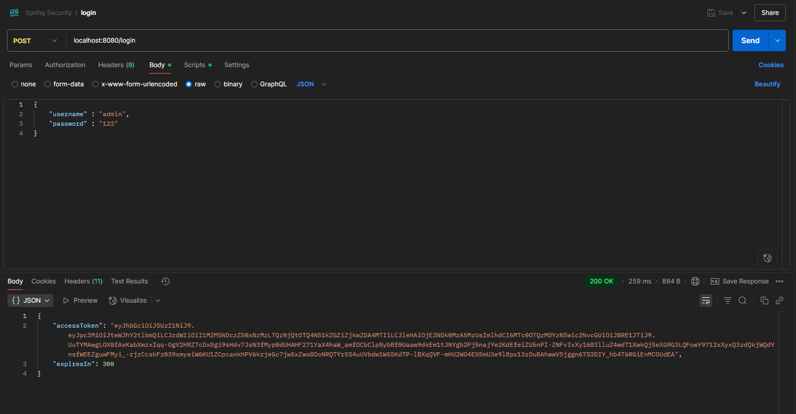
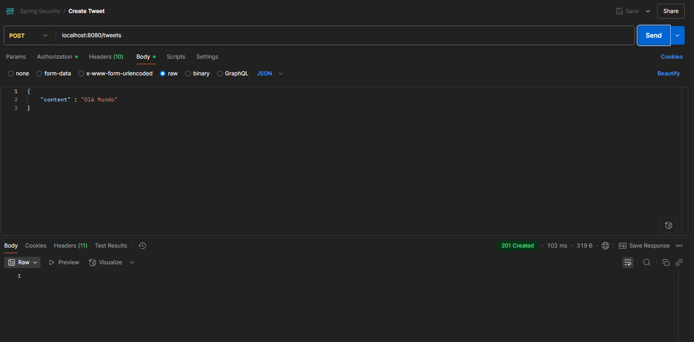
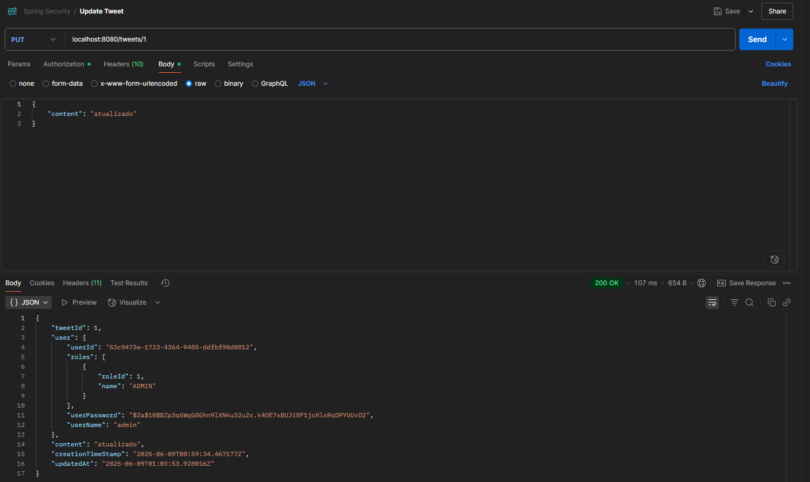
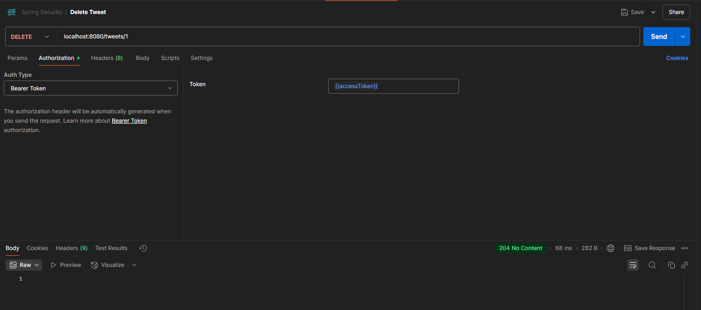
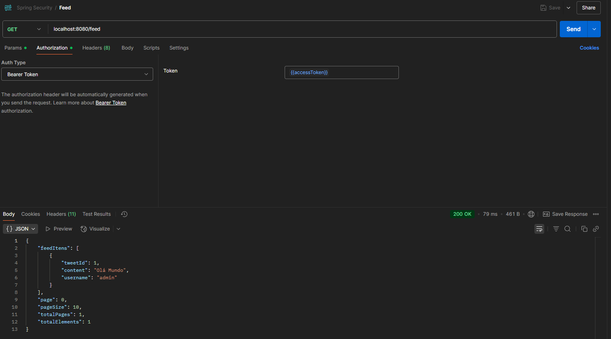
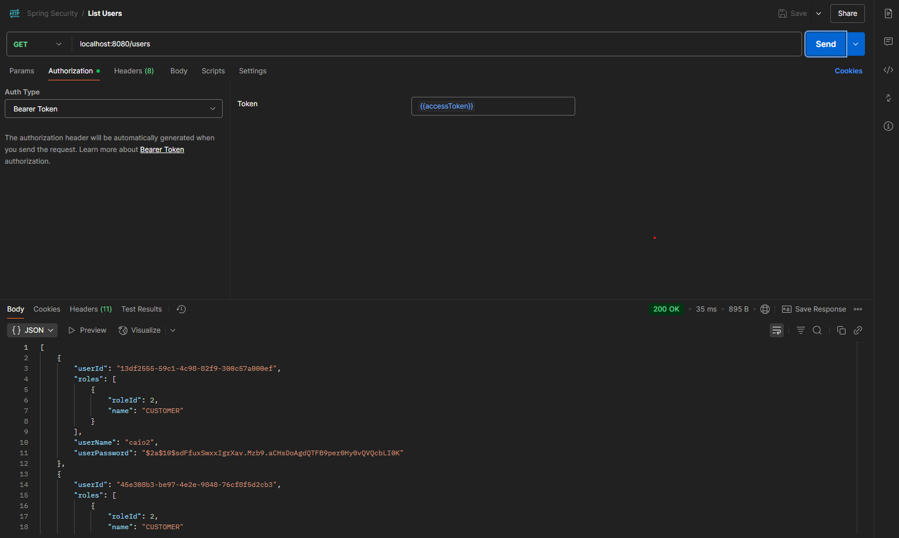

# 🛡️ Projeto Spring Security com JWT - Java 21

Este é um projeto de estudo que tem como objetivo aprender e aplicar conceitos de **autenticação e autorização** usando **JWT (OAuth2)** com Java 21, Spring Boot, Spring Security, BCrypt e MySQL (via Docker).

---

## 🔧 Tecnologias Utilizadas

- Java 21
- Spring Boot
- Spring Security
- OAuth2 com JWT
- BCrypt para criptografia de senhas
- MySQL (via Docker)
- Docker Compose
- JPA / Hibernate
- RESTful API

---

## 🚀 Endpoints

| Método | Rota              | Descrição                                        |
|--------|-------------------|--------------------------------------------------|
| POST   | `/login`          | Realiza login e retorna o token JWT             |
| POST   | `/users`          | Cria um novo usuário                             |
| POST   | `/tweets`         | Cria um novo tweet (necessário token)           |
| PUT    | `/tweets/{id}`    | Atualiza um tweet (somente dono ou admin)       |
| DELETE | `/tweets/{id}`    | Deleta um tweet (somente dono ou admin)         |
| GET    | `/feed`           | Lista os tweets com paginação (necessário token)|
| GET    | `/users`           | Lista os usuarios (necessário token de adiministrador)|

---

## 🔐 Autenticação

Este projeto utiliza autenticação via **Bearer Token** (JWT).  
Após realizar o login em `/login`, você receberá um `accessToken`.  
Use-o no cabeçalho das requisições protegidas da seguinte forma:


> Apenas os endpoints `/login` e `/users` são públicos. Todos os outros requerem autenticação.

---

## 🗝️ Geração das Chaves RSA (caso necessário)

As chaves já estão incluídas no projeto, **não é necessário gerar novamente**.  
Caso queira gerar novas chaves, utilize o site:

🔗 [https://cryptotools.net/rsagen](https://cryptotools.net/rsagen)

Ou utilize os comandos abaixo:

```bash
openssl genrsa -out private.pem 2048
openssl rsa -in private.pem -pubout -out public.pem
```
---

## 🐬 Configuração do Banco de Dados com Docker
O projeto já possui um docker-compose.yml pronto com o container do MySQL configurado.

📦 Passo a passo para inicializar o projeto:

```bash
cd docker
docker compose up -d
```
O banco estará rodando em localhost:3306 com:

 * usuário: admin

 * senha: 123

 * database: mydb

---

## 📘 Padrão de Projeto
Este projeto segue o padrão de desenvolvimento RESTful, com divisão clara entre controladores, entidades, DTOs e repositórios.

- POST /users
- Content-Type: application/json

### 👤 Criar usuário:



```bash
{
  "username": "caio",
  "password": "123"
}
```
---

### 🔐 Login

- POST /login
- Content-Type: application/json



```bash
{
  "username": "caio",
  "password": "123"
}
```
---

### 📝 Criar tweet (com token):

- POST /tweets
- Authorization: Bearer <accessToken>
Content-Type: application/json



```bash
{
  "content": "Olá, mundo!"
}
```
---

### ✏️ Atualizar tweet (com token):

- PUT /tweets/1
- Authorization: Bearer <accessToken>
- Content-Type: application/json



```bash
{
  "content": "Tweet editado!"
}
```
---

### 🗑️ Deletar tweet (com token):

- DELETE /tweets/1
- Authorization: Bearer <accessToken>



---

### 📰 Listar feed:

- GET /feed
- Authorization: Bearer <accessToken>



---
### 📰 Listar usuario (apenas admin):

- GET /users
- Authorization: Bearer <accessToken>


